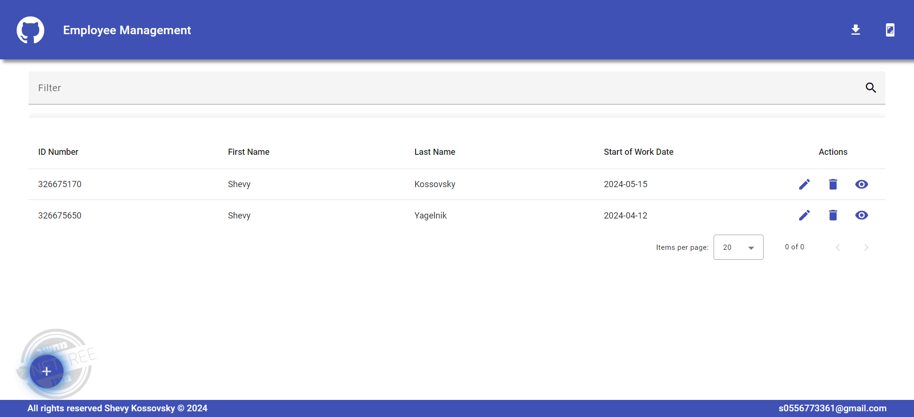
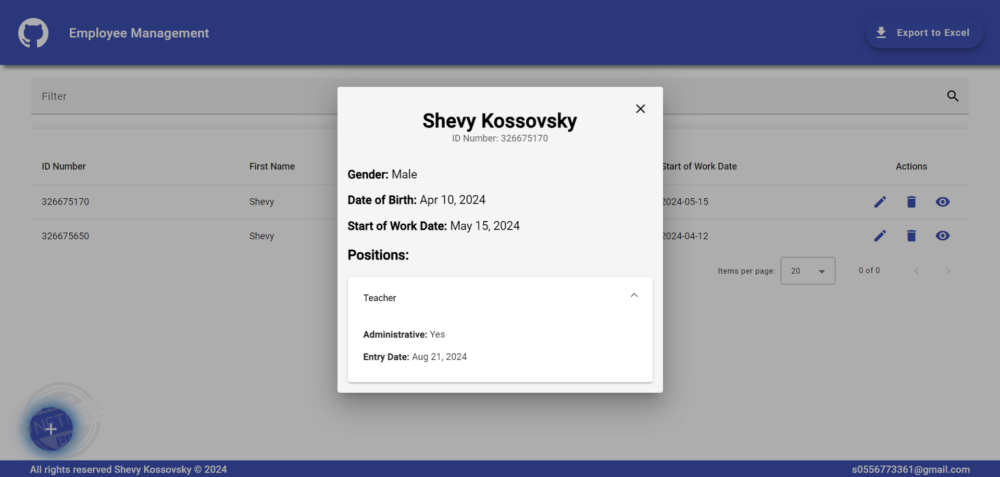

# Employee Management Application - Client

[Watch here->](https://employee-management-app-edf89.web.app/employees)

<a href="https://employee-management-app-edf89.web.app/employees" target="_blank">Watch here-></a>

## Description

This is the front end of the employee management application built using Angular v17. The application allows managing employee data, including adding, editing, and deleting employees. You can also view the employee details or export them to the local computer.

The app uses various external libraries, including Angular Material, to enhance its user interface and provide a visually appealing experience.

## Technologies Used

- **Frontend**: Angular v17
- **Design Libraries**:
  - Angular Material

### Implemented Features

- Input integrity validations ensure data consistency and accuracy.
- Emphasis on effective division of layers and writing clean, maintainable code in the application's architecture.
- User-friendly and visually appealing design enhances the overall user experience.

## License

© 2024 Shevy Kossovsky. All rights reserved.

### Contact

0556773361  
s0556773361@gmail.com

